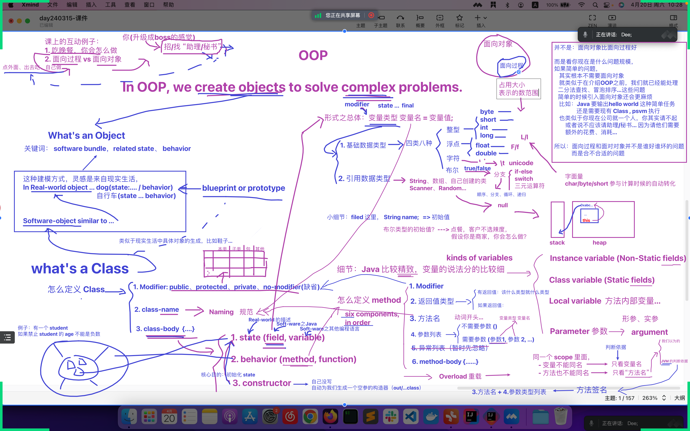

## 阶段复习
### 现场写笔记，一起会议

## 其实 Java 也能听懂 HTML 语言

### 添加 Jsoup 包
- 新建一个文件夹存放第三方 jar 包

- Add as Library

### 初识 Jsoup
- https://jsoup.org/

- Add exception to method signature

- JsoupDemo2: 精确获取诗经信息
  - https://jsoup.org/cookbook/extracting-data/selector-syntax
  - https://so.gushiwen.org/gushi/shijing.aspx

