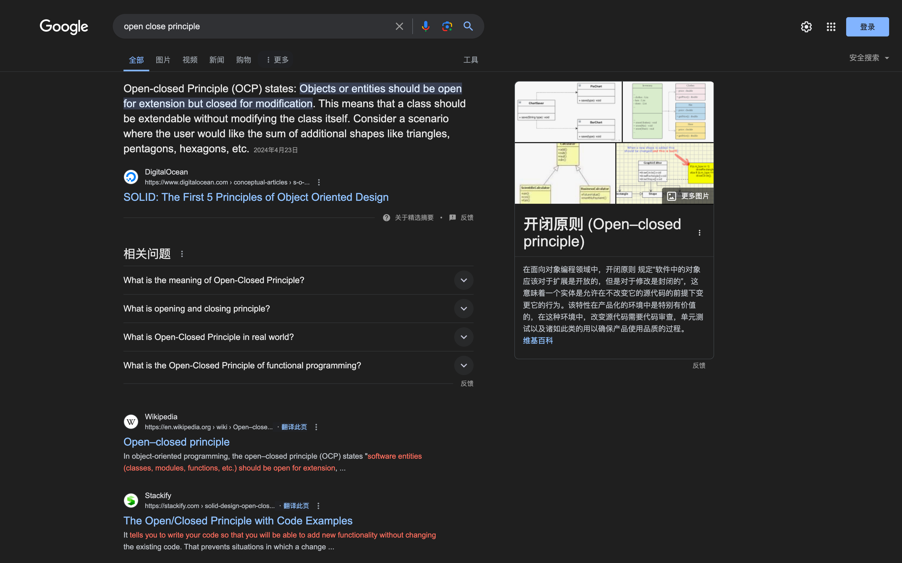
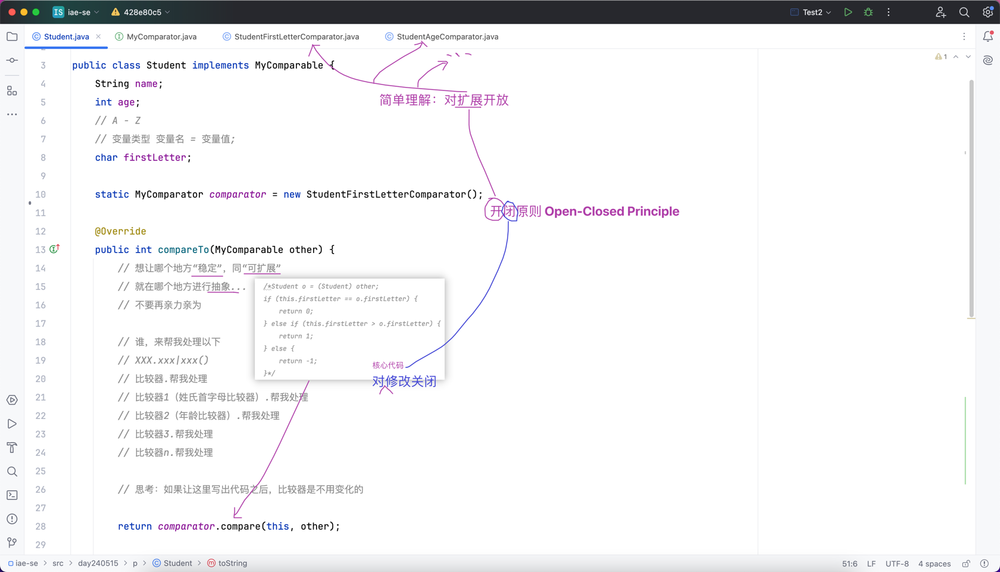
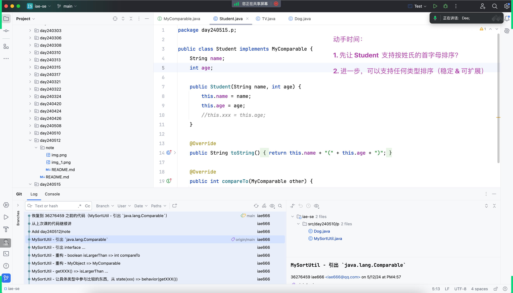
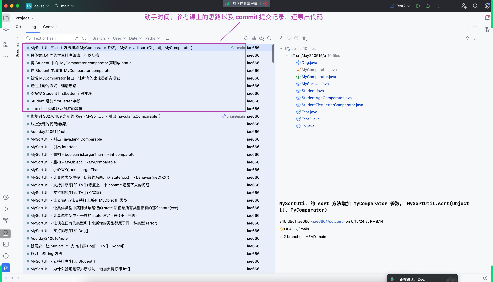

## 新需求：支持按学生姓名的姓氏首字母排序
### 方式一：直接修改 compareTo 方法内部的代码
### 方式二：硬性要求：代码重构，重构之后，让 compareTo 方法不需要在变化

## 开闭原则 Open-Closed Principle
- Open => 对扩展开放

- Closed => 对修改关闭（核心代码的修改）

## 结合实际案例，辅助理解开闭原则

## 练习

