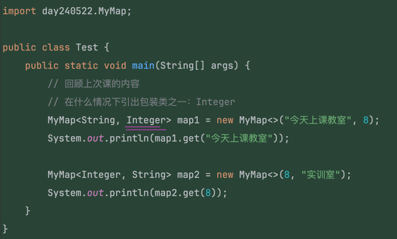
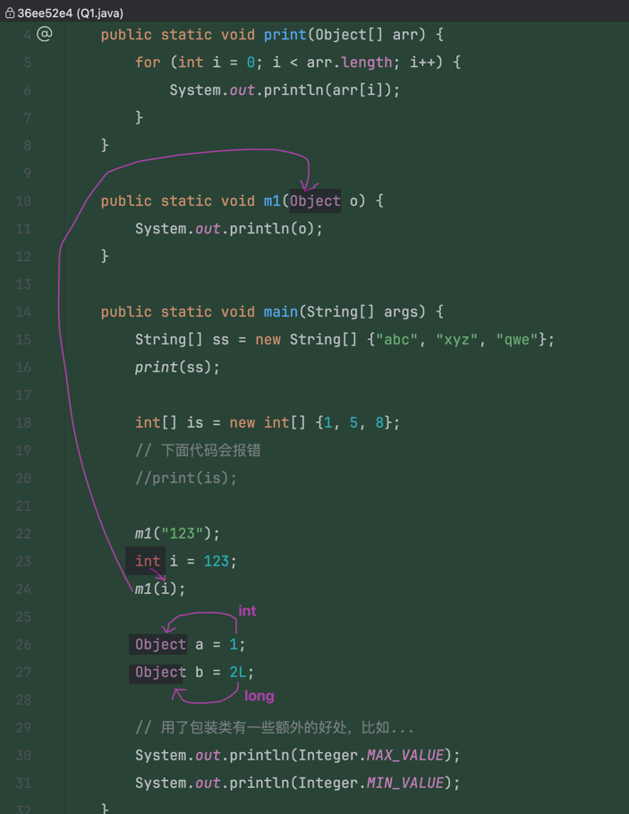
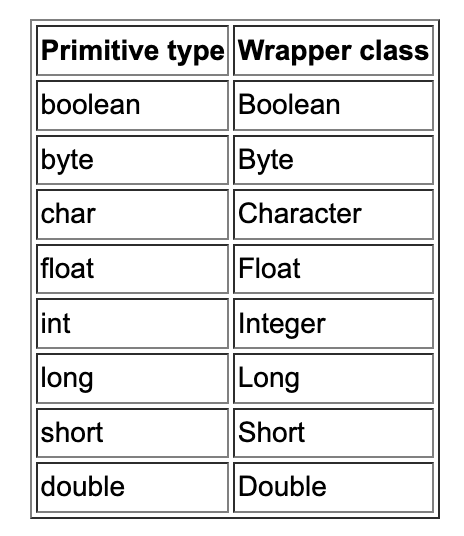
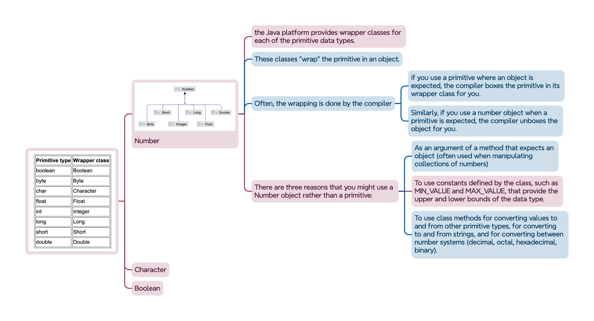
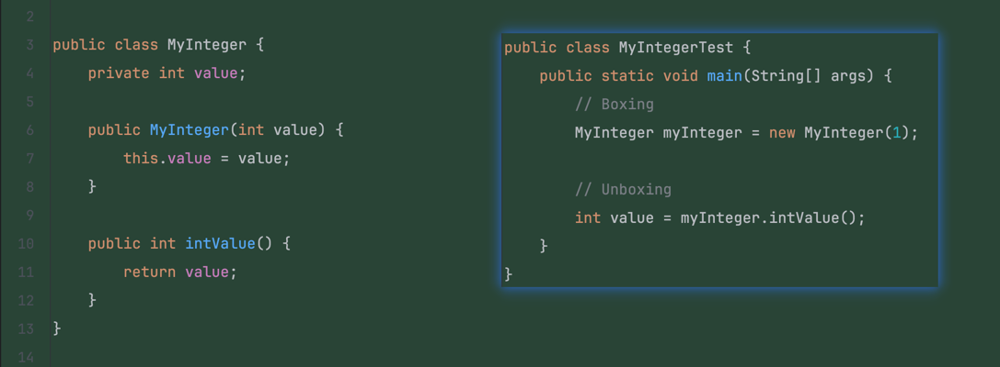
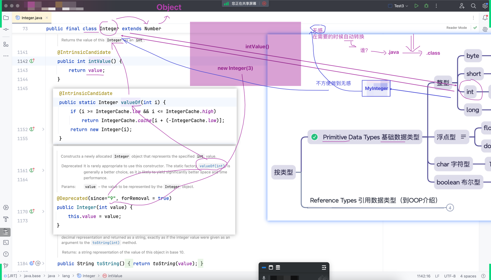
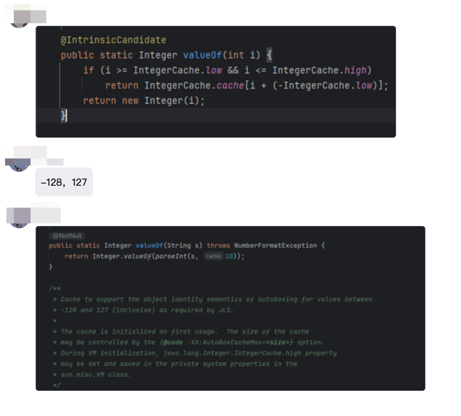
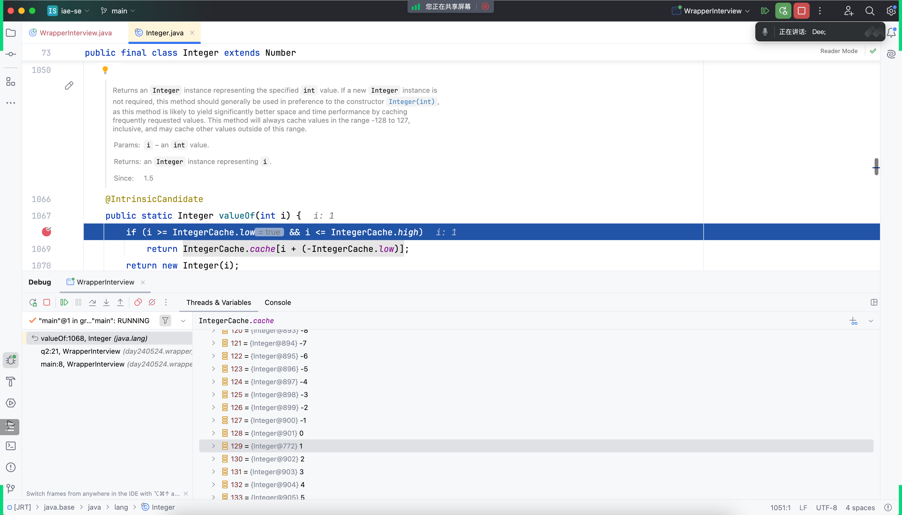
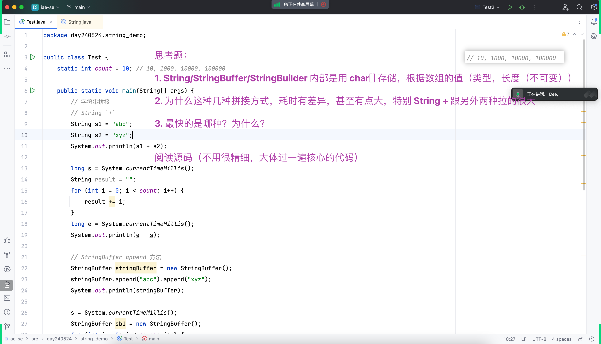

### 快速回顾上次课在什么情况下引出包装类之一：Integer
- 泛型中的类型，必需是引用数据类型；快速引出了 Integer
    - 

## 包装类 Wrapper class
### 初见
- 

### the Java platform provides wrapper classes for each of the primitive data types.
- 
- 

### 自己写一个 MyInteger 类，模拟 Integer 的核心逻辑
- 

### MyInteger 的有感 vs Integer 的无感
- 

### 主动 `new Integer` vs `Integer.valueOf` 及面试题
- 

### `Integer.valueOf` 会用缓存进行优化：IntegerCache
- 
- 

### Autoboxing and Unboxing
- 

## 动手时间：不同方式的字符串拼接耗时对比
- String `+`
- StringBuffer `append`
- StringBuilder `append`

## 课后思考
- 