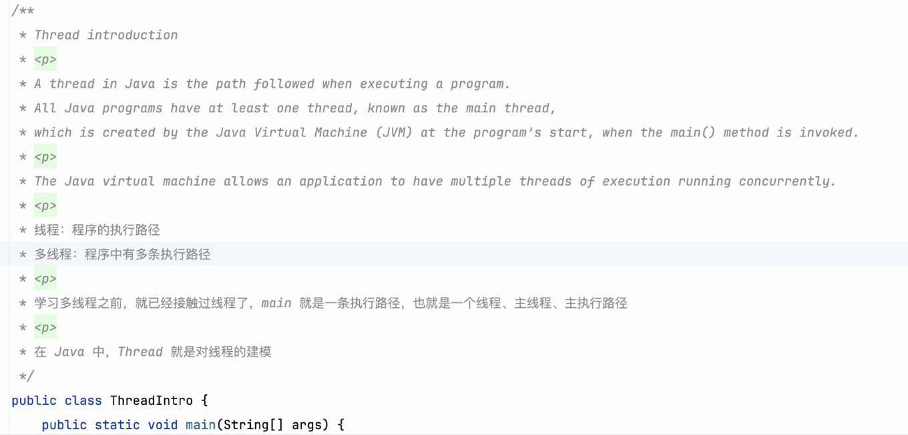
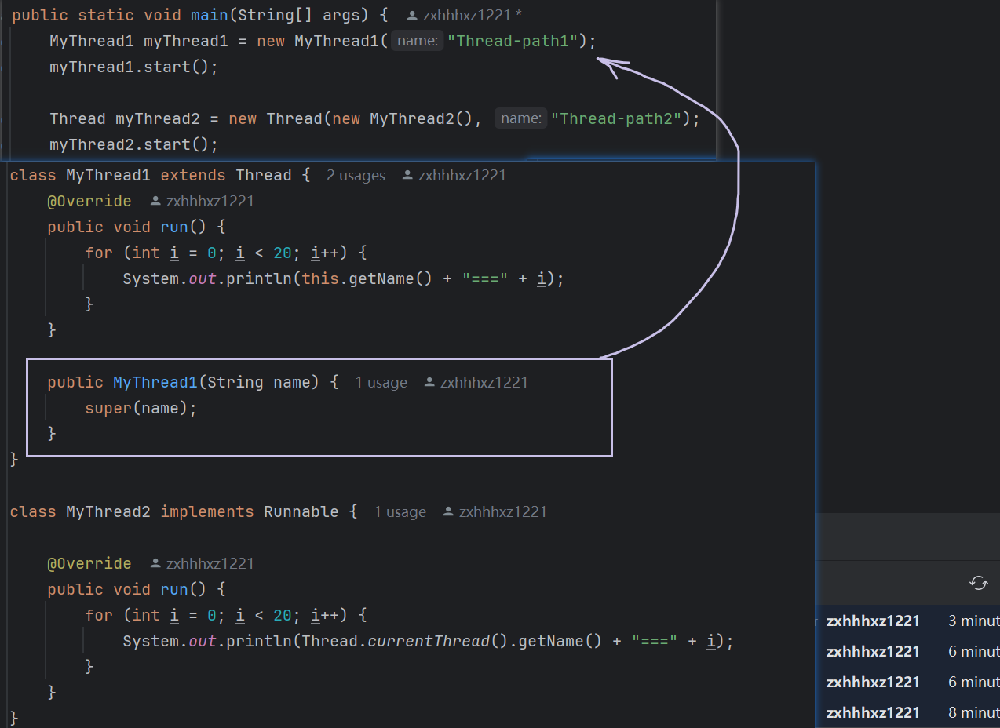
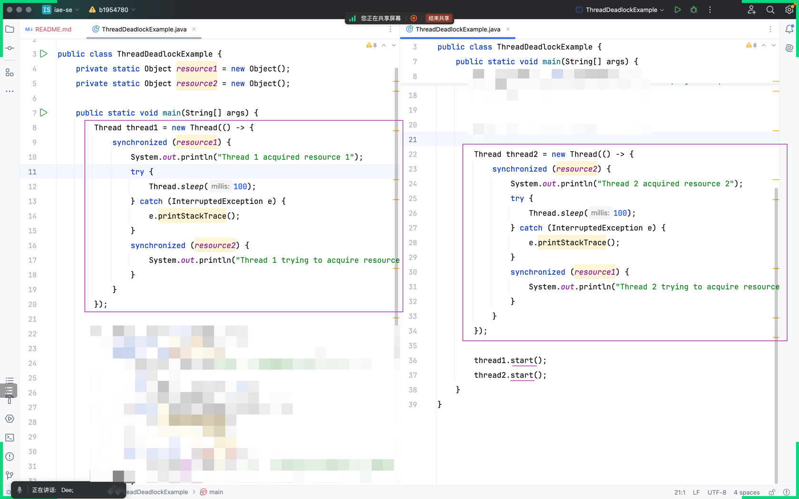

## 阅读时间
- 
### 资料
- 中文资料: https://www.ruanyifeng.com/blog/2013/04/processes_and_threads.html
- 英文资料: https://docs.oracle.com/javase/tutorial/essential/concurrency/procthread.html

### 注意点  
- 尽信书不如无书
- 看资料的时候，可以加个问号，持怀疑的态度
- 评论区容易出人才，特别是技术文章，如果有评论，别忘了去看它
  - 
- 英文资料的时候，注意软件翻译的准确性

## 直观感受`进程`和`线程`

## Thread Introduction  

## 如何启动一条新的执行路径？  

## 给线程指定名字  
  

## Thread - 调用 `run()` 和 `start()` 的差别

## Thread - 思考 `extends Thread` VS `implements Runnable`

## Thread - `原始的写法` VS `匿名的 Runnable 子类` VS `lambda 表达式`  

## 小总结
- `线程` 简单理解: 它就是一条执行路径
- 如何开辟执行路径: 见 `如何启动一条新的执行路径？`
- 在这条新开辟的执行路径上要做什么任务: 包在 `run` 方法里面

## 方法提取  

## Thread - 通过控制台的输出直观感受 - 线程状态 - `不确定`

## Thread - 通过阅读源码的方式，看线程的状态 `Thread.State`

## Thread 常用方法
- Thread.sleep

- join

- Thread.yield

- setPriority

- isAlive

## synchronized  
## 直接写在方法声明中  

## 锁在更精确的位置上  

--------------
- 
- 
- 上两张图的 this 和 xxx.class 可以替换成下图的实现方式  
- 

## 死锁 Deadlock  
- 
- 

## TicketWindows 模拟车站买票的场景
- 版本1 - ArrayList

- 版本2 - Vector

- 版本3 - Vector + Thread.sleep

- 版本4 - synchronized

- 版本5 - ConcurrentLinkedQueue

