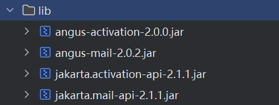
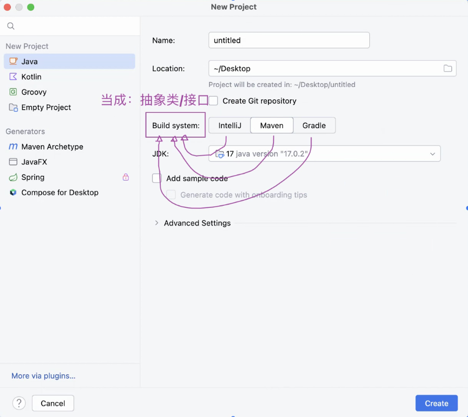
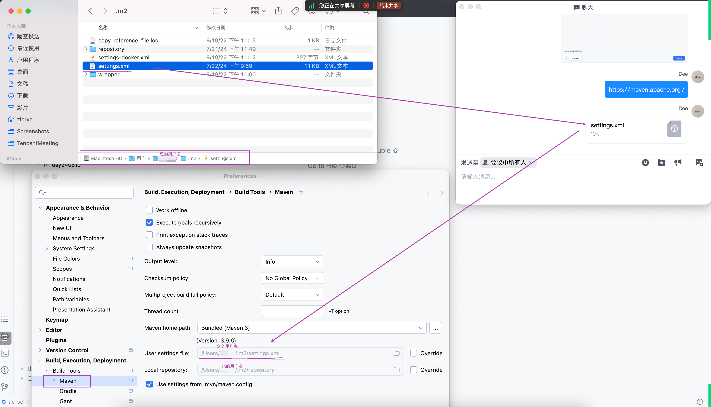
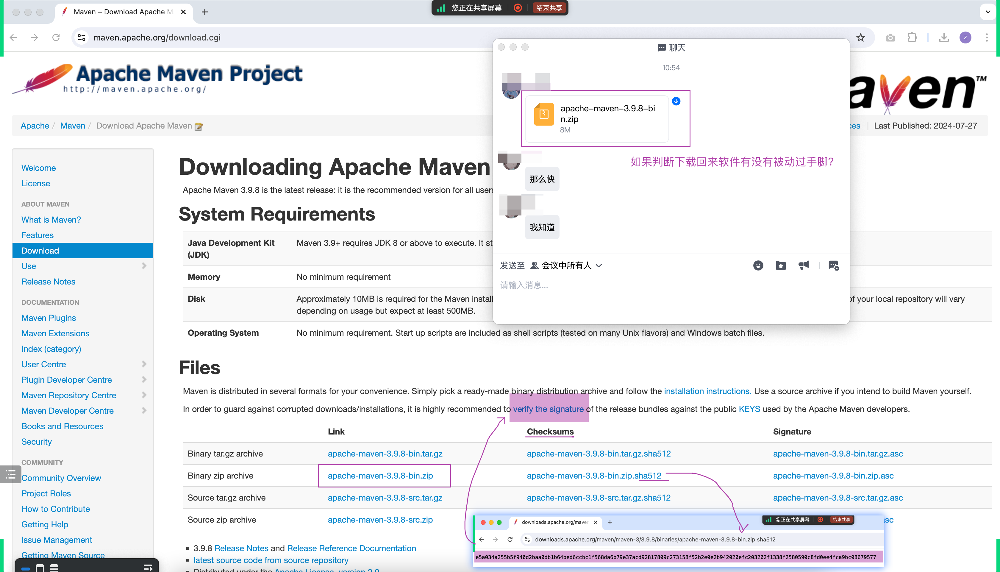
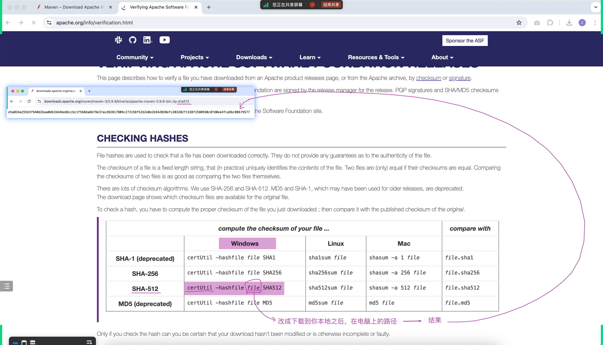

## 回顾 - 如果要把第三方的 `Jsoup` 提高功能，我们的步骤是怎样的？
回顾 day20240420

### 继续思考  
- 下一个问题: 如果要更新 `Jsoup` 又该怎么做？
- 在回忆之前引入邮件发送功能，不止一个 jar 包，它的更新又如何？
  -  

## 引出 Build System  

## `settings.xml`

## 如何判断下载下来的软件有没有被动过手脚  

